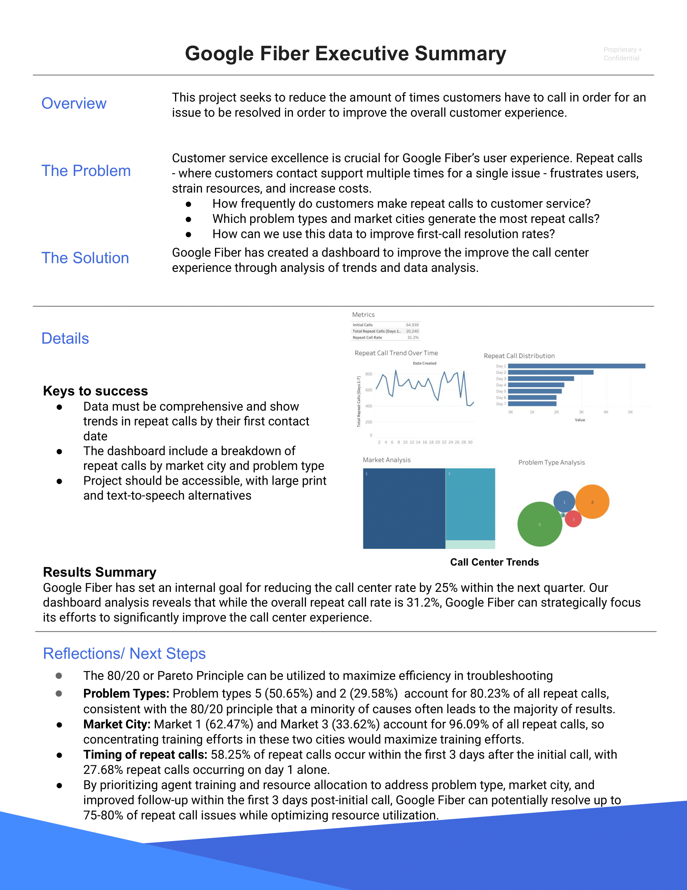

# google-fiber-dashboard-analytics
Google Fiber Dashboard for Improving Call Center Performance

Enabling real-time insights for customer-focused, data-driven decisions to improve call center performance.

[Live Dashboard](https://public.tableau.com/app/profile/melissa.slawsky1925/viz/GoogleFiberCallCenterDashboard_17290044323220/Dashboard1)

## Executive Summary & Key Findings

### Strategic Insights: The 80/20 Principle in Action
Our analysis revealed powerful opportunities for optimization through the Pareto Principle:

1. **Problem Type Focus (80.23% of Issues)**
   - Type 5 Issues: 50.65% of repeat calls
   - Type 2 Issues: 29.58% of repeat calls
   - Strategic Focus: Targeting these two problem types addresses majority of challenges

2. **Market Concentration (96.09% of Volume)**
   - Market 1: 62.47% of repeat calls
   - Market 3: 33.62% of repeat calls
   - Resource Optimization: Focusing on these markets maximizes improvement impact

3. **Timing Patterns**
   - 27.68% of repeat calls occur on Day 1
   - 58.25% of repeat calls happen within first 3 days
   - Critical Window: Enhanced follow-up within 3-day window

### Business Impact
- Potential to resolve 75-80% of repeat call issues
- Target: 25% reduction in call center rate (next quarter)
- Current repeat call rate: 31.2%
- Optimized resource allocation model

## Project Documentation

### Business Intelligence Documents
- [Strategy Document](strategy-doc-google-fiber.pdf)
- [Stakeholder Requirements](stakeholder-requirements-google-fiber.pdf)
- [Project Requirements](project-requirements-google-fiber.pdf)
- [Follow-up Questions](follow-up-questions-google-fiber.pdf)
- [Dashboard Mockup](dashboard-mockup-google-fiber.png)

### Data Analysis Process
📁 data/
├── [Market 1 Data](market_1.csv)         # Market 1 call center data
├── [Market 2 Data](market_2.csv)         # Market 2 call center data
├── [Market 3 Data](market_3.csv)         # Market 3 call center data
└── [Combined Analysis](bq-results-20241010-184832-1728586149684.csv) # BigQuery results

### Dashboard Development
1. **Data Integration & Cleaning**
   - Consolidated market data
   - Standardized formats
   - Validated consistency

2. **Metric Development**
   - First Contact Resolution (FCR) Rate
   - 7-Day Follow-up Patterns
   - Market Performance Metrics
   - Problem Type Distribution

3. **Visualization Strategy**
   - Real-time performance tracking
   - Cross-market comparison
   - Problem type analysis
   - Temporal trend visualization

### Implementation Recommendations
1. **Immediate Actions**
   - Focus training on Problem Types 5 and 2
   - Prioritize Markets 1 and 3
   - Enhance 3-day follow-up protocols

2. **Resource Optimization**
   - Targeted training programs
   - Market-specific support teams
   - Enhanced first-call resolution protocols

### Contact
For inquiries about this analysis:
- [LinkedIn Profile](https://www.linkedin.com/in/melissaslawsky/)
- [Professional Website](https://melissaslawsky.com/client-results/)
- [Tableau Portfolio](https://public.tableau.com/app/profile/melissa.slawsky1925/vizzes)
- [Email](mailto:melissa@melissaslawsky.com)

---
© Melissa Slawsky 2024. All Rights Reserved.
This repository contains proprietary analysis. All rights reserved.

Published Project URL: [Google Fiber Call Center Dashboard](https://public.tableau.com/app/profile/melissa.slawsky1925/viz/GoogleFiberCallCenterDashboard_17290044323220/Dashboard1)
