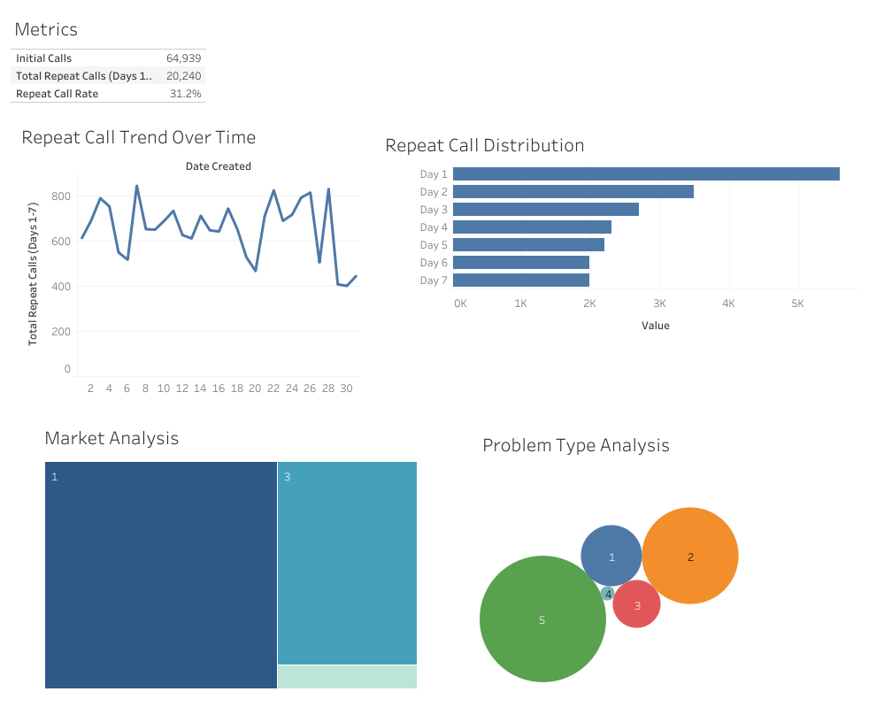

# Google Fiber Dashboard Analytics

**Google Fiber Dashboard for Improving Call Center Performance**  
This project enables real-time insights for customer-focused, data-driven decisions aimed at improving call center performance.

### [Live Dashboard](https://public.tableau.com/app/profile/melissa.slawsky1925/viz/GoogleFiberCallCenterDashboard_17290044323220/Dashboard1)

---

## Executive Summary & Key Findings

---

### Strategic Insights: The 80/20 Principle in Action

Our analysis revealed optimization opportunities aligned with the Pareto Principle:

1. **Problem Type Focus (80.23% of Issues)**:
   - **Type 5 Issues**: 50.65% of repeat calls
   - **Type 2 Issues**: 29.58% of repeat calls
   - **Strategic Focus**: Targeting these problem types addresses the majority of challenges.

2. **Market Concentration (96.09% of Volume)**:
   - **Market 1**: 62.47% of repeat calls
   - **Market 3**: 33.62% of repeat calls
   - **Resource Optimization**: Focusing on these markets maximizes improvement impact.

3. **Timing Patterns**:
   - 27.68% of repeat calls occur on Day 1
   - 58.25% of repeat calls happen within the first 3 days
   - **Critical Window**: Enhanced follow-up within a 3-day window is recommended.

### Business Impact
- **Goal**: 25% reduction in repeat call rate next quarter (currently 31.2%)
- **Potential Impact**: Resolve 75-80% of repeat call issues
- **Resource Allocation Model**: Optimized for efficiency

---

## Project Documentation

### Business Intelligence Documents
- [Strategy Document](https://github.com/mslawsky/google-fiber-dashboard-analytics/raw/main/strategy-doc-google-fiber.pdf) (PDF)
- [Stakeholder Requirements](https://github.com/mslawsky/google-fiber-dashboard-analytics/raw/main/stakeholder-requirements-google-fiber.pdf) (PDF)
- [Project Requirements](https://github.com/mslawsky/google-fiber-dashboard-analytics/raw/main/project-requirements-google-fiber.pdf) (PDF)
- [Follow-up Questions](https://github.com/mslawsky/google-fiber-dashboard-analytics/raw/main/follow-up-questions-google-fiber.pdf) (PDF)
- [Dashboard Mockup](https://github.com/mslawsky/google-fiber-dashboard-analytics/raw/main/dashboard-mockup-google-fiber.png) (Image)

### Data Analysis Process

📂 **Data Files**
- [Market 1 Call Center Data](https://github.com/mslawsky/google-fiber-dashboard-analytics/blob/main/market1.csv)
- [Market 2 Call Center Data](https://github.com/mslawsky/google-fiber-dashboard-analytics/blob/main/market2.csv)
- [Market 3 Call Center Data](https://github.com/mslawsky/google-fiber-dashboard-analytics/blob/main/market3.csv)
- [Combined BigQuery Analysis](https://github.com/mslawsky/google-fiber-dashboard-analytics/blob/main/bq-results-20241010-184832-1728586149684.csv)

---

## Dashboard Development

1. **Data Integration & Cleaning**
   - Consolidated market data
   - Standardized formats
   - Validated consistency

2. **Metric Development**
   - First Contact Resolution (FCR) Rate
   - 7-Day Follow-up Patterns
   - Market Performance Metrics
   - Problem Type Distribution

3. **Visualization Strategy**
   - Real-time performance tracking
   - Cross-market comparison
   - Problem type analysis
   - Temporal trend visualization

### Implementation Recommendations

1. **Immediate Actions**
   - Focus training on Problem Types 5 and 2
   - Prioritize Markets 1 and 3
   - Enhance 3-day follow-up protocols

2. **Resource Optimization**
   - Targeted training programs
   - Market-specific support teams
   - Enhanced first-call resolution protocols

---

## Contact

For inquiries about this analysis:
- [LinkedIn Profile](https://www.linkedin.com/in/melissaslawsky/)
- [Professional Website](https://melissaslawsky.com/client-results/)
- [Tableau Portfolio](https://public.tableau.com/app/profile/melissa.slawsky1925/vizzes)
- [Email](mailto:melissa@melissaslawsky.com)

---

© Melissa Slawsky 2025. All Rights Reserved.  
This repository contains proprietary analysis.

**Published Project URL**: [Google Fiber Call Center Dashboard](https://public.tableau.com/app/profile/melissa.slawsky1925/viz/GoogleFiberCallCenterDashboard_17290044323220/Dashboard1)
